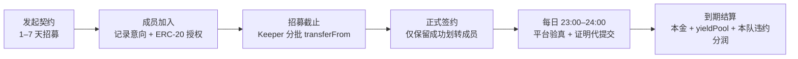
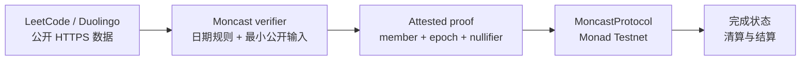

# Moncast architecture

## 生命周期

`MoncastProtocol.activateMembers()` 每批最多处理 24 人。没有余额或已撤销授权的成员会被排除，不会阻塞整队。最终不足 2 名有效成员时契约取消，已划转成员可自行退款。

## 信任边界

平台用户名、邀请码、API URL 和原始响应不写入合约。测试网 `AttestedProofVerifier` 验证 attestor 签名，提供可替换的验证边界，但不等同于 SNARK。生产版必须换成经过审计的 ZK-TLS 证明系统。

## 自动执行

- Cron 每 5 分钟调用 `/api/cron/complete`，通过 `CRON_SECRET` 鉴权。
- 招募截止后，relayer 分批调用 `activateMembers`；Monad 交易使用即时估算值加最多 10% Gas 缓冲。
- 对每个契约按 `utcOffsetMinutes` 计算本地时间，仅在 23:00–24:00 请求平台数据。
- 已有当日 `completedEpoch` 的成员直接跳过，不重复生成证明或广播交易。
- 未达标成员不会广播失败交易；48 小时无有效证明后可被任何地址清算。

本地登记使用权限为 `0600`、且被 Git 忽略的 `data/automation-registry.json`。生产部署必须换成加密的持久数据库，并为注册接口增加会话和速率限制。

## 私密邀请

深链仍使用 `?join=<id>&code=<code>`，但 code 本身不进入 calldata。服务端确认 code 后，签发绑定 `pactId / participant / nonce / deadline` 的 EIP-712 一次性凭证；合约验证契约指定的 `inviteAuthority`。

## 事件与索引

建议生产索引：`PactCreated`、`MemberEnrolled`、`MemberFunded`、`MemberDeclined`、`PactActivated`、`Completed`、`MemberLiquidated`、`PactFinalized`、`RewardClaimed`。当前本地广场通过链上事件验证后的轻量登记文件提供数据。
